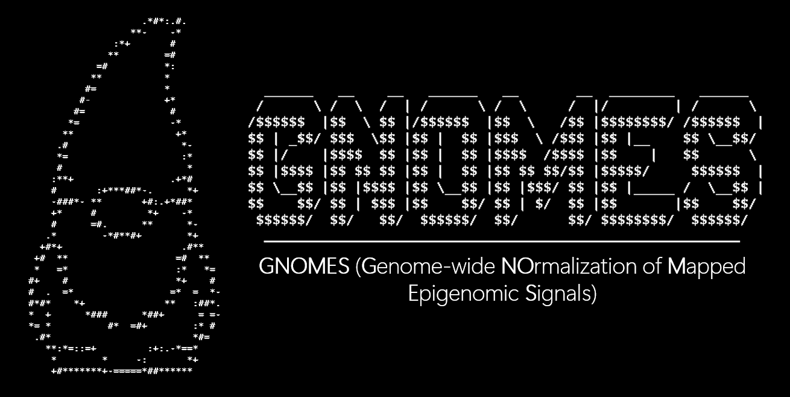

<p align="center">
  
</p>

<h1 align="center">GNOMES</h1>

<p align="center">
  <b>Genome-wide NOrmalization of Mapped Epigenomic Signals</b><br>
  Normalization + differential binding for Cut&Run / ChIP-seq, with reproducible QC and publication-ready outputs.
</p>

<p align="center">
  <a href="#overview">Overview</a> •
  <a href="#two-step-workflow">Two-step workflow</a> •
  <a href="#installation">Installation</a> •
  <a href="#quick-start">Quick start</a> •
  <a href="#inputs">Inputs</a> •
  <a href="#outputs">Outputs</a> •
  <a href="#How-GNOMES-Works">How GNOMES works</a> •
  <a href="#contributing">Troubleshooting</a> •
  <a href="#citation">Citation</a>
</p>

---

## Overview

**GNOMES** is a user-friendly framework to:

1. **Normalize** epigenomic signal tracks from BAM files using a robust percentile-based scaling strategy.
2. **Perform differential binding analysis** over user-defined regions, or automatically generated peaks, using DESeq2 with built-in quality control.

GNOMES is designed for **Cut&Run** and **ChIP-seq** (Single-End or Paired-End), and supports both histone marks and transcription factors.

---

## Two-step workflow

GNOMES is a **two-step method**:

### **Step 1 — Normalization (`GNOMES norm`)**
- BAM → raw bigWig → bedGraph (optional blacklist filtering)
- Identify local maxima per sample
- Compute the 99th percentile of local signal maxima per sample
- Normalize signals
- Generate:
  - normalized bigWigs (`*.norm99.bw`)
  - scaling factors table (`scaling_factors.tsv`)
  - median tracks per (condition, target)
  - QC plots (PCA + correlation heatmap) for **raw** and **normalized** bigWigs

### **Step 2 — Differential binding (`GNOMES diff`)**
- Use either:
  - user-provided BED regions (`--regions`)
  - or generate a MACS2 pooled-per-condition peaks → qscore filter → merged consensus (`--call-peaks`)
- Quantify per-region signal from normalized bigWigs
- Run **DESeq2** differential analysis
- Generate:
  - volcano + MA plot
  - PCA + sample correlation heatmap (from DESeq2 VST)
  - significant gain/loss region tables (TSV)
  - **optional** deepTools heatmap + profile plot over significant regions
  - **optional** PCA + sample correlation heatmap (from DESeq2 VST) for RAW bigWig files

---


## Installation

GNOMES can be installed through **conda** (recommended).

### Conda/Mamba

```bash
# Clone the repo
git clone https://github.com/RouleThomas/GNOMES.git
cd GNOMES

# Installation
## Conda
conda env create -f env/GNOMES-environment.yml
## Mamba
mamba env create -f env/GNOMES-environment.yml

conda activate GNOMES


# Install dependencies
pip install -e .

# Test
GNOMES norm --help
GNOMES diff --help
```


### XXX something else?


## Quick start

GNOMES is a two-step pipeline: **normalize** first, then **diff**.

### **Step 1 — Normalize**

```
GNOMES norm \
  --meta meta/samples.tsv \
  --outdir output/gnomes_run \
  --blacklist meta/hg38-blacklist.v2.bed \
  --chrom-sizes meta/GRCh38_chrom_sizes.tab \
  --threads 8 \
  --mode SE \
  --se-fragment-length 200 \
  --reference auto
```


### **Step 2 — Differential binding (using your own BED regions)**

```
GNOMES diff \
  --meta meta/samples.tsv \
  --call-peaks \
  --bigwig-dir output/gnomes_run/06_normalized_bigwig \
  --contrast condition:KO:WT \
  --target H3K27me3 \
  --outdir output/gnomes_run_diff \
  --alpha 0.05 \
  --lfc 0.5 \
  --min-counts 100 \
  --macs2-mode broad \
  --macs2-qvalue 0.005 \
  --macs2-merge 100

```

### **Step 2 — Differential binding (MACS2 consensus peaks)**


## Inputs

### Metadata file (`--meta`)

Tab-separated file with required columns:

| column      | description                                    |
| ----------- | ---------------------------------------------- |
| `sample_id` | unique sample name (used for output filenames) |
| `bam`       | path to BAM file                               |
| `condition` | condition label (ie. WT, KO)                 |
| `target`    | mark/TF name (ie. H3K27me3, EZH2)            |


Example:
```
sample_id	bam	condition	target
WT_1	/path/WT_1.bam	WT	H3K27me3
WT_2	/path/WT_2.bam	WT	H3K27me3
KO_1	/path/KO_1.bam	KO	H3K27me3
KO_2	/path/KO_2.bam	KO	H3K27me3
```

### Regions BED (`--regions`, diff step only)

Standard BED3:
```
chr  start  end
```

If you use `--call-peaks`, GNOMES builds regions automatically from MACS2 pooled-per-condition peaks.


## Outputs

### Step 1 (Normalization) output structure

**`--outdir` contains**:
- `01_raw_bigwig/sample_id.bw` (raw)
- `02_bedgraph/sample_id.bedGraph`
- `03_bedgraph_blacklist/`
blacklist-filtered bedGraph (or identical copy if no blacklist)
- `04_local_maxima/sample_id.local_maxima.bed`
- `05_normalized_bedgraph/sample_id.norm99.bedGraph` (+ sorted)
- `06_normalized_bigwig/sample_id.norm99.bw`
- `07_median_bedgraph/` and `08_median_bigwig/`
median tracks per (condition, target)
- `09_qc/`
PCA + correlation heatmap for raw and normalized bigWigs (per target)
- `scaling_factors.tsv`
P99 and scaling factor per sample
- `normdb_normalize.log`
full command log (including all tool calls)


### Step 2 (Differential binding) output structure

**`--outdir` contains**:
- `02_regions/`
copied user BED, or MACS2 consensus peaks BED
- `03_computeMatrix/`
per-sample computeMatrix outputs for normalized bigWigs
- `04_deeptools_heatmap/` (optional)
heatmap/profile over significant gain/loss regions (normalized only)
- `counts_matrix.tsv`
per-region counts from normalized bigWigs
- `coldata.tsv`
sample_id + condition column used in DESeq2
- `results_all_regions.tsv`
complete DESeq2 results table
- `results_signif_gain.tsv` / `results_signif_loss.tsv`
significant regions split by direction
- `volcano.pdf`, `MA.pdf`, `PCA_vst.pdf`, `sample_correlation_heatmap.pdf`
- Optional raw-derived:
    - `counts_matrix_RAW_bigwig.tsv`
    - `PCA_vst_RAW_bigwig.pdf`
    - `sample_correlation_heatmap_RAW_bigwig.pdf`
- `normdb_diffbind.log`
full command log + exact tool calls for reproducibility


## How GNOMES works

### Normalization strategy

GNOMES:
1. converts BAM → bedGraph
2. finds local maxima along each bedGraph
3. computes the 99th percentile of maxima scores per sample (P99)
4. within each target, uses a reference sample and scales other samples by:
```
scaling_factor(sample) = P99(reference_sample) / P99(sample)
```
This yields normalized bedGraphs / bigWigs that are robust to global occupancy shifts.

### Differential binding strategy

GNOMES converts bigWig signal into per-region counts (computeMatrix) and runs DESeq2:
- VST transform for PCA / correlation
- LFC shrinkage (apeglm if available)
- significant gain/loss calls based on:
    - `padj < alpha`
    - `|log2FoldChange| >= lfc`


## Contributing

Contributions are welcome:
- bug reports and feature requests via GitHub Issues


Please include:
- command used
- log file


## Citation

If you use GNOMES in your work, please cite:

***Roule T. et al. GNOMES: Genome-wide NOrmalization of Mapped Epigenomic Signals. [Journal] (YEAR).***

(Preprint / DOI coming soon.)


