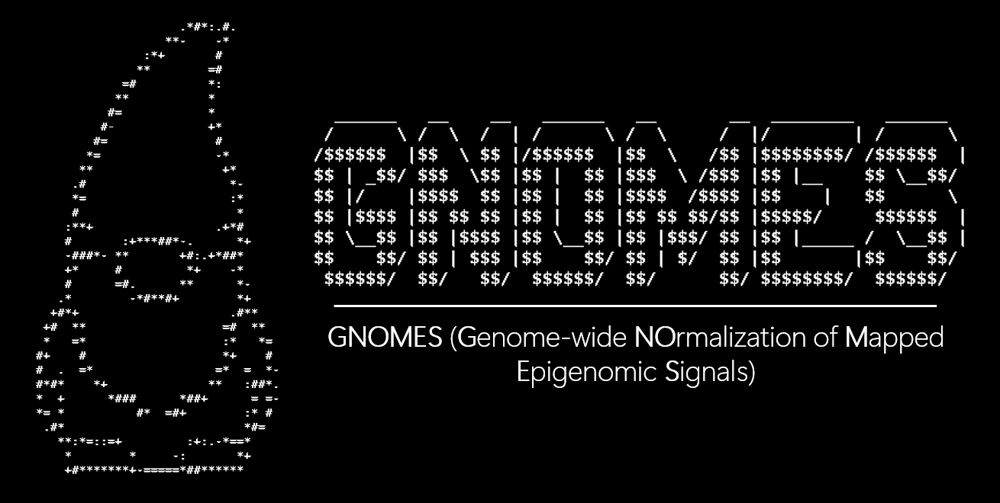
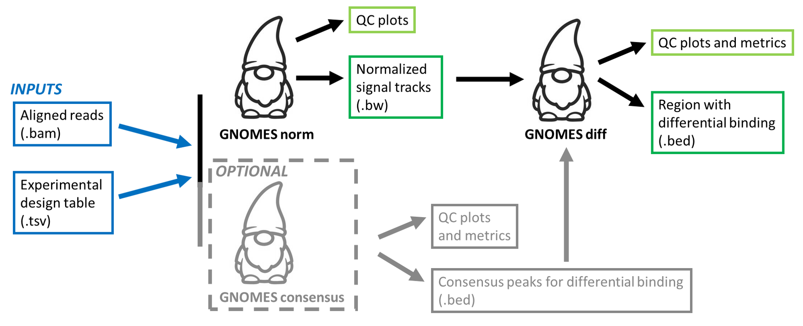
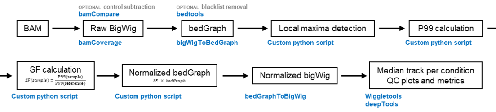
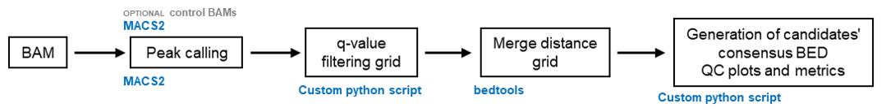
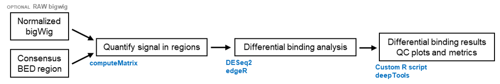

<p align="center">
  
</p>

<h1 align="center">GNOMES</h1>

<p align="center">
  <b>Genome-wide NOrmalization of Mapped Epigenomic Signals</b><br>
  Normalization + differential binding for Cut&Run / ChIP-seq, with fine-tunable parameters, QC and publication-ready outputs.
</p>

<p align="center">
  <a href="#overview">Overview</a> •
  <a href="#workflow-and-methodology">Workflow and methodology</a> •
  <a href="#installation">Installation</a> •
  <a href="#quick-start">Quick start</a> •
  <a href="#manuscript-example-workflow">Manuscript example</a> •
  <a href="#command-examples">Command examples</a> •
  <a href="#choosing-a-differential-method">Choosing a differential method</a> •
  <a href="#inputs">Inputs</a> •
  <a href="#outputs">Outputs</a> •
  <a href="#contributing">Contributing</a> •
  <a href="#citation">Citation</a>
</p>

---

## Overview

***GNOMES*** is a user-friendly framework to:

1. **Normalize** epigenomic signal tracks from BAM files using a robust percentile-based scaling strategy.
2. **Perform differential binding analysis** over user-defined regions, or automatically generated peaks, using DESeq2 (or edgeR) with built-in quality control.

***GNOMES*** is designed for **Cut&Run** and **ChIP-seq** (Single-End or Paired-End), and supports both histone marks and transcription factors.

>**Manuscript example workflow:**  
>A step-by-step example reproducing the H3K27me3 mouse cerebellum analysis presented in the ***GNOMES*** manuscript is available in [`example_workflow/`](example_workflow/).

---


## Workflow and methodology

***GNOMES*** is organized around three complementary commands:
- `GNOMES norm` → signal normalization
- **[OPTIONAL]** `GNOMES consensus` → exploration of candidate consensus peak sets for differential binding analysis
- `GNOMES diff` → differential binding analysis

<p align="center">
  
</p>

In most analyses, users run `GNOMES norm` followed by `GNOMES diff`. The **`GNOMES consensus` module is optional** and can be used to explore candidate peak sets and **help select the most appropriate regions for differential binding analysis**.

### **Step 1 — Normalization (`GNOMES norm`)**
<p align="center">
  
</p>

**Goal**: Generate scaled bigWig tracks across samples.

**Pipeline**:
1. Convert BAM → raw bigWig → bedGraph (*optional* blacklist filtering + control(input/IGG) subtraction)
2. Identify local maxima in each bedGraph
3. Compute the 99th percentile (P99) of local signal maxima per sample
4. Within each target, select a **reference*** sample and compute scaling factor (SF): `SF(sample) = P99(reference_sample) / P99(sample)`

**Reference*: For each chromatin target, ***GNOMES*** uses the first sample listed in the metadata file as the reference for P99 scaling. The reference sample therefore has a scaling factor of 1, while all other samples are scaled relative to it. 

5. Apply SF to generate normalized signal tracks

**Outputs**:
- normalized bigWigs (`*.norm99.bw`)
- scaling factors table (`scaling_factors.tsv`)
- median tracks per (condition, target)
- QC plots (PCA + correlation heatmap) for **raw** and **normalized** bigWigs

This percentile-based normalization is designed to stabilize signal distributions without assuming equal total occupancy across samples.


### **[OPTIONAL] — Consensus peak exploration (`GNOMES consensus`)**
<p align="center">
  
</p>

**Goal**: Explore candidate consensus peak sets by scanning multiple MACS2 peak calling thresholds and merge distances.

*Why optional?* `GNOMES diff` can analyze any user-provided genomic regions, including promoters, enhancers, previously defined peak sets, or other regions of interest supplied as a BED file. Therefore, the consensus module is not required when regions are already defined. However, for de novo peak-centric differential binding analysis, we recommend using `GNOMES consensus` to identify appropriate candidate regions across the conditions being compared.

**Pipeline**:
1. Pool BAM files per condition (and per target)
2. Run MACS2 peak calling
3. Build consensus peak sets across grids of Q-value thresholds and peak merging distances
4. Evaluate peak width distributions across candidates

**Outputs**:
- candidate consensus BED files
- summary table of peak statistics
- peak width distribution plots for each candidate set

This step can **help identify robust regions for downstream differential binding analysis**. We recommend loading multiple candidate consensus peak BED files into IGV and comparing them with the normalized bigWig tracks from **Step 1** to select the most appropriate peak set for downstream differential binding analysis.

If no matched control (*bam_control*) is available, `--macs2-nolambda` can be used to disable MACS2 local lambda estimation for control-free peak calling.

### **Step 2 — Differential binding (`GNOMES diff`)**
<p align="center">
  
</p>

**Goal**: Identify regions with significant binding changes (ie. gained or lost) between biological conditions.

GNOMES supports two strategies:
- User-provided BED regions (`--regions`)
- Automatically generated MACS2 consensus peaks (`--call-peaks`)

  
**Pipeline**:
1. Quantify per-region signal from normalized bigWigs
2. Convert signal into count-like matrices
3. Perform differential analysis using DESeq2 or edgeR

**Outputs**:
- volcano + MA plot
- PCA + sample correlation heatmap (from DESeq2 VST)
- significant gain/loss region tables (TSV)
- **optional** deepTools heatmap + profile plot over significant regions
- **optional** PCA + sample correlation heatmap (from DESeq2 VST) for RAW bigWig files
---


## Installation

### Option 1 — Conda

#### Linux / Unix

```bash
# Clone the repo
git clone https://github.com/RouleThomas/GNOMES.git
cd GNOMES

# Create GNOMES conda environment for Linux / Unix
conda env create -f env/GNOMES-environment.yml

# Activate GNOMES conda environment
conda activate GNOMES

# Install dependencies
pip install -e .
pip install --no-binary :all: MACS2==2.2.9.1 # OPTIONAL: only if using GNOMES consensus, or GNOMES diff --call-peaks

# Test
GNOMES norm --help
GNOMES consensus --help
GNOMES diff --help
```

#### macOS Apple Silicon / ARM64

```bash
# Clone the repo
git clone https://github.com/RouleThomas/GNOMES.git
cd GNOMES

# Create GNOMES conda environment for macOS ARM64
conda env create -f env/GNOMES-environment-macos.yml

# Activate GNOMES conda environment
conda activate GNOMES

# Install GNOMES
pip install -e .

# Test
GNOMES norm --help
GNOMES consensus --help
GNOMES diff --help
```

On macOS ARM64, MACS2 is installed through Bioconda inside `env/GNOMES-environment-macos.yml`.  
No manual `pip install --no-binary :all: MACS2==2.2.9.1` step is required.


### Option 2 — Apptainer / Singularity

**Use pre-built container** (recommended)
```bash
# Download container
wget https://github.com/RouleThomas/GNOMES/releases/download/v1.0.0/GNOMES_v1.0.0.sif

# Test
apptainer exec GNOMES_v1.0.0.sif GNOMES norm --help
apptainer exec GNOMES_v1.0.0.sif GNOMES consensus --help
apptainer exec GNOMES_v1.0.0.sif GNOMES diff --help
```

**Build container from source**
```bash
# Clone the repo
git clone https://github.com/RouleThomas/GNOMES.git
cd GNOMES

# Build container
apptainer build GNOMES.sif GNOMES_apptainer.def

# Test
apptainer exec GNOMES.sif GNOMES norm --help
apptainer exec GNOMES.sif GNOMES consensus --help
apptainer exec GNOMES.sif GNOMES diff --help
```


---


## Quick start

***GNOMES*** is a two-step pipeline: **normalize** first, then **differential binding**.

An optional **consensus peak exploration** step can be run between them to help select the most appropriate peak regions for differential binding analysis.

### **Step 1**


**Normalize**: Generate normalized bigWig signal tracks from BAM files using the P99 scaling strategy.

```
GNOMES norm \
  --meta <metadata.tsv> \
  --outdir <output_directory> \
  --chrom-sizes <chrom_sizes.tab> \
  --mode <SE|PE>
```
- `--mode SE|PE` specifies whether reads are Single-End (SE) or Paired-End (PE).
- `--chrom-sizes` must match the genome assembly used for alignment.
- Normalized bigWig files will be written to: `<output_directory>/06_normalized_bigwig/`. These tracks are used in downstream differential binding analysis.


**[OPTIONAL] — Explore candidate consensus peaks**: Generate multiple candidate consensus peak sets by scanning different *MACS2* peak-calling thresholds and merge distances.
```
GNOMES consensus \
  --meta <metadata.tsv> \
  --outdir <output_directory>
```
This step helps identify robust peak regions for differential binding analysis. Candidate BED files can be visually inspected in IGV alongside the normalized bigWig tracks from Step 1.


### **Step 2**

**Differential binding *using your own BED regions***: Run differential binding analysis on predefined BED regions (e.g., promoters, enhancers, or consensus peaks generated with GNOMES consensus).
```
GNOMES diff \
  --regions <regions.bed> \
  --meta <metadata.tsv> \
  --bigwig-dir <normalized_bigwig_directory> \
  --contrast <column:group1:group2> \
  --target <mark_or_TF> \
  --outdir <output_directory>
```
- `--regions` provides the BED file containing regions to test.
- `--contrast` defines the comparison in the format: `<metadata_column>:<group1>:<group2>`. For example `condition:KO:WT`


**Differential binding *on MACS2 consensus peaks***: Alternatively, GNOMES can automatically generate consensus peaks during the differential binding step.

```
GNOMES diff \
  --call-peaks \
  --meta <metadata.tsv> \
  --bigwig-dir <normalized_bigwig_directory> \
  --contrast <column:group1:group2> \
  --target <mark_or_TF> \
  --outdir <diff_output_directory>
```

With `--call-peaks`, the *MACS2* consensus peak pipeline is fully configurable via `--macs2-*` options. ***GNOMES*** automatically pools replicates per condition, and if `bam_control` is provided in the metadata, matching control BAMs are used during peak calling. The *deepTools* heatmap and profile plot are also fully configurable (`--hm-*` and `--pp-*` options).

This approach is useful for quick exploratory analyses. However, for more robust results we recommend using peak regions generated with `GNOMES consensus`, which allows manual inspection and selection of the most appropriate peak set.

---

## Manuscript example workflow

A complete example reproducing the H3K27me3 ChIP-seq analysis from mouse cerebellum at P12 and P21 presented in the ***GNOMES*** manuscript is available in [`example_workflow/`](example_workflow/).

The example includes:
- Download of processed BAM and reference files
- Metadata file preparation
- Signal normalization with `GNOMES norm`
- Consensus peak identification with `GNOMES consensus`
- Differential binding analysis with `GNOMES diff`

---

## Command examples

**Example 1 — Single-End (with blacklist) and Differential binding using user BED regions with DESEQ2**

This example performs normalization of single-end Cut&Run/ChIP-seq data with blacklist filtering, then uses `GNOMES consensus` to generate multiple candidate consensus peak sets. After visual inspection (e.g., in IGV), the selected BED regions are used for DESeq2-based differential binding analysis.

```bash
GNOMES norm \
  --meta meta/samples.tsv \
  --outdir output/gnomes_run \
  --blacklist meta/hg38-blacklist.v2.bed \
  --chrom-sizes meta/GRCh38_chrom_sizes.tab \
  --threads 8 \
  --mode SE \
  --se-fragment-length 200

GNOMES consensus \
  --meta meta/samples.tsv \
  --outdir output/gnomes_run

GNOMES diff \
  --meta meta/samples.tsv \
  --regions output/gnomes_run/02_consensus_beds/consensus*.bed \
  --bigwig-dir output/gnomes_run/06_normalized_bigwig \
  --contrast condition:KO:WT \
  --target H3K27me3 \
  --outdir output/gnomes_run_diff \
  --diff-method deseq2 \
  --deseq2-alpha 0.05 \
  --deseq2-lfc 0.58 \
  --deseq2-min-counts 100 \
  --deseq2-sizefactors auto
```

**Example 2 — Paired-End (without blacklist) and Differential binding using MACS2 consensus peaks with edgeR**

This example performs normalization of paired-end data and runs differential binding directly with `GNOMES diff` using the built-in MACS2 consensus peak calling pipeline. This approach is useful for quick analyses, as peak regions are automatically generated without running `GNOMES consensus`.

```bash
GNOMES norm \
  --meta meta/samples.tsv \
  --outdir output/gnomes_run \
  --chrom-sizes meta/GRCh38_chrom_sizes.tab \
  --threads 8 \
  --mode PE

GNOMES diff \
  --meta meta/samples.tsv \
  --call-peaks \
  --bigwig-dir output/gnomes_run/06_normalized_bigwig \
  --contrast condition:KO:WT \
  --target H3K27me3 \
  --outdir output/gnomes_run_diff \
  --macs2-mode broad \
  --macs2-qvalue 0.005 \
  --macs2-merge 100 \
  --diff-method edger \
  --edger-alpha 0.05 \
  --edger-lfc 0.58 \
  --edger-min-counts 100 \
  --edger-norm TMM
```

---

## Choosing a differential method

***GNOMES*** supports both DESeq2 and edgeR, and users are **strongly encouraged to explore different normalization strategies** depending on their specific data. We recommend visually inspecting the significant gain/loss BED files generated in `04_deeptools_heatmap/` by loading them into IGV alongside the normalized bigWig tracks. This manual inspection can help the choice of the most appropriate differential method and normalization strategy.

In our experience, the following configurations are robust starting points:
- `--diff-method deseq2 --deseq2-sizefactors auto`
- `--diff-method edger --edger-norm TMM`
- `--diff-method edger --edger-norm RLE`

**If a global shift in occupancy is expected** (ie. near-complete gain or loss of a mark), we recommend using `--deseq2-sizefactors none` or `--edger-norm none`. By default, DESeq2 and edgeR apply median-based library normalization, which assumes that most regions are not changing. Disabling this step prevents correction toward the median and preserves true global shifts.

---

## Inputs

### Metadata file (`--meta`; all steps)

Tab-separated file with required columns:

| column       | description                                    |
| ------------ | ---------------------------------------------- |
| `sample_id`  | unique sample name (used for output filenames) |
| `bam`        | path to **BAM*** file                               |
| `condition`  | condition label (ie. WT, KO)                   |
| `target`     | mark/TF name (ie. H3K27me3, EZH2)              |
| **OPTIONAL**** `bam_control` | path to BAM control (input/IGG) file           |

*To avoid artificial signal inflation in repetitive regions, we recommend using sorted BAM with uniquely aligned reads only.

**When control BAM sample is provided, control sample is subtracted from corresponding IP sample


Example:
```
sample_id	bam	condition	target  bam_control
WT_H3K27me3_1	/path/WT_H3K27me3_1.bam	WT	H3K27me3  /path/WT_input_1.bam
WT_H3K27me3_2	/path/WT_H3K27me3_2.bam	WT	H3K27me3  /path/WT_input_2.bam
KO_H3K27me3_1	/path/KO_H3K27me3_1.bam	KO	H3K27me3  /path/KO_input_1.bam
KO_H3K27me3_2	/path/KO_H3K27me3_2.bam	KO	H3K27me3  /path/KO_input_2.bam
WT_EZH2_1	/path/WT_EZH2_1.bam	WT	EZH2  /path/WT_input_1.bam
WT_EZH2_2	/path/WT_EZH2_2.bam	WT	EZH2  /path/WT_input_2.bam
KO_EZH2_1	/path/KO_EZH2_1.bam	KO	EZH2  /path/KO_input_1.bam
KO_EZH2_2	/path/KO_EZH2_2.bam	KO	EZH2  /path/KO_input_2.bam
```


### Chromosome sizes (`--chrom-sizes`; normalization step)

Tab-separated file containing chromosome names and lengths.

Example:
```
chr1    248956422
chr2    242193529
chr3    198295559
chr4    190214555
chr5    181538259
```

This file is used by *bedGraphToBigWig* to generate bigWig tracks. It must match the genome assembly used for read alignment.

### Regions BED (`--regions`, diff step)

Standard BED3:
```
chr start end
```

If you use `--call-peaks`, ***GNOMES*** builds regions automatically from *MACS2* pooled-per-condition peaks. However, we recommend using `GNOMES consensus` to generate candidate consensus peak sets and visually inspecting them (e.g., in IGV) against the normalized bigWig tracks to select the most appropriate regions for differential binding analysis.

---

## Outputs

### Step 1 (Normalization) output structure

**`--outdir` contains**:
- `01_raw_bigwig/sample_id.bw` (raw)
- **OPTIONAL (Default OFF)** `02_bedgraph/sample_id.bedGraph`
- **OPTIONAL (Default OFF)** `03_bedgraph_blacklist/`
blacklist-filtered bedGraph (or identical copy if no blacklist)
- **OPTIONAL (Default OFF)** `04_local_maxima/sample_id.local_maxima.bed`
- **OPTIONAL (Default OFF)** `05_normalized_bedgraph/sample_id.norm99.bedGraph` (+ sorted)
- `06_normalized_bigwig/sample_id.norm99.bw`
- **OPTIONAL (Default OFF)** `07_median_bedgraph/`
- `08_median_bigwig/`
median tracks per (condition, target)
- `09_qc/`
PCA + correlation heatmap for raw and normalized bigWigs (per target)
- `scaling_factors.tsv`
P99 and scaling factor per sample
- `GNOMES_norm.log`
full command log

### Step (Consensus peak exploration) output structure

**`--outdir` contains**:
- ` 01_macs2_peaks/` MACS2 peaks called on pooled BAMs per (condition, target)
- `02_consensus_beds/` consensus peak BED files generated across combinations of MACS2 q-value thresholds and peak merge distances
- `consensus_summary.tsv` summary table reporting peak statistics for each candidate consensus set (e.g., number of peaks, width statistics)
- `consensus_width_distributions.pdf`  PDF showing peak width distributions for each candidate consensus peak set
- `GNOMES_consensus.log` full command log


### Step 2 (Differential binding) output structure

**`--outdir` contains**:
- `02_regions/`
copied user BED, or MACS2 consensus peaks BED
- `03_computeMatrix/`
per-sample computeMatrix outputs for normalized bigWigs
- **OPTIONAL (Default ON)** `04_deeptools_heatmap/`
heatmap/profile over significant gain/loss regions (normalized only)
- `counts_matrix.tsv`
per-region counts from normalized bigWigs
- `coldata.tsv`
sample_id + condition column used in DESeq2
- `results_all_regions.tsv`
complete DESeq2 results table
- `results_signif_gain.tsv` / `results_signif_loss.tsv`
significant regions split by direction
- `volcano.pdf`, `MA.pdf`, `PCA_vst.pdf`, `sample_correlation_heatmap.pdf`
- **OPTIONAL (Default ON)** raw-derived:
    - `counts_matrix_RAW_bigwig.tsv`
    - `PCA_vst_RAW_bigwig.pdf`
    - `sample_correlation_heatmap_RAW_bigwig.pdf`
- `GNOMES_diff.log`
full command log

---

## Contributing

Contributions are welcome (bug reports and feature requests via *GitHub Issues*)! 

---

## Citation

If you use ***GNOMES*** in your work, please cite:

Thomas Roule and Naiara Akizu. **GNOMES: an integrated framework for genome-wide normalization and differential binding analysis of CUT&RUN and ChIP-seq data**. *bioRxiv* 2026. [doi.org/10.64898/2026.04.16.718722](https://www.biorxiv.org/content/10.64898/2026.04.16.718722v1)


